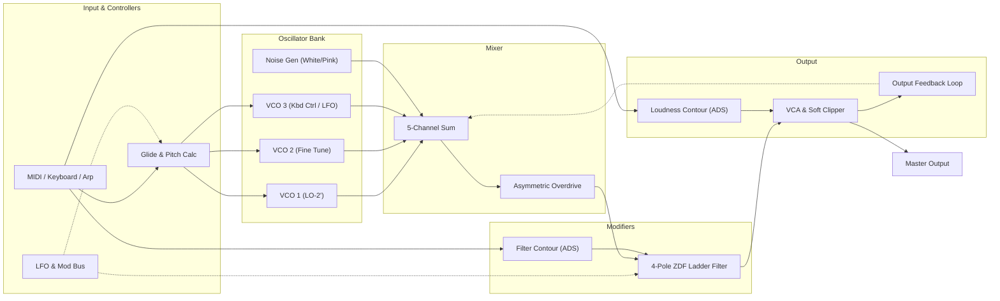

# LadderMono — User Manual

## 1. Signal Flow Diagram

## 2. Controls Explanation

### Controllers
- **Tune:** Master tuning fine adjustment (±100 cents).
- **Glide:** Portamento speed (exponential constant-time).
- **Mod Mix:** Blends modulation sources between LFO/Osc3 and Noise.
- **Osc Mod & Filter Mod:** Routes the modulation bus to pitch and/or filter cutoff.

### Arpeggiator
- **Arp On:** Activates the arpeggio sequencer.
- **Latch:** Holds chord notes when keys are released.
- **Mode:** Up, Down, Up/Down, Random, As Played.
- **Octaves:** 1, 2, 3, or 4 octaves.
- **Rate:** Synced to host tempo (1/4 to 1/32) or Free rate (Hz).

### Oscillators
- **Range:** Pitch octave in feet (LO, 32', 16', 8', 4', 2').
- **Waveform:** Triangle, Shark-fin, Sawtooth, Square, Wide Pulse, Narrow Pulse.
- **Fine:** Fine-tune offset for Osc 2 and Osc 3.
- **Kbd Ctrl (Osc 3):** When turned off, Osc 3 functions at a fixed pitch or low-frequency oscillator.

### Mixer
- Levels and toggle mutes for Osc 1, Osc 2, Osc 3, Noise, and External Feedback.
- **Noise Color:** White or -3 dB/oct Pink noise.
- **Mixer Drive:** Analog saturation drive into the filter.

### Filter & Envelopes
- **Cutoff:** Ladder filter cutoff frequency (20 Hz to 20 kHz).
- **Emphasis:** Resonance; reaches authentic self-oscillation at 9–10.
- **Contour Amount:** Envelope depth modulating the cutoff.
- **Kbd 1 & 2:** Keyboard tracking switches (1/3, 2/3, full).
- **Bass Comp:** Compensates for passband attenuation under high resonance.
- **Filter ADS & Loudness ADS:** Attack, Decay, Sustain.
- **Decay Switch:** When active, Decay time also controls Release time.
